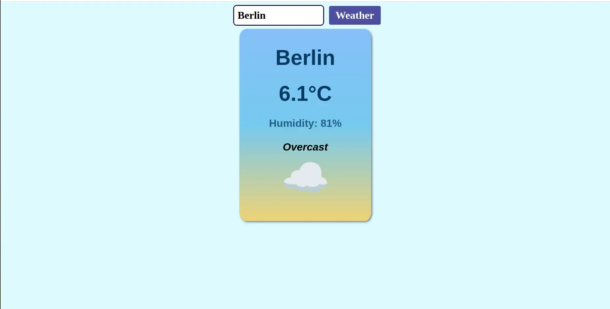

# Full Stack Web Developer

## Contact
| Mail | LinkedIn |
|:----:|:--------:|
| <a href="mailto:dinomussuto89@gmail.com"> dinomussuto89@gmail.com</a> | <a href="www.linkedin.com/in/gerardo-michele-mussuto" target="_blank"> LinkedIn – Gerardo Michele Mussuto</a> |

## Tech Stack

### Layout Design

| HTML5 | CSS3 | SASS | Tailwind | Bootstrap | Figma | React |
|:-----:|:----:|:----:|:--------:|:---------:|:-----:|:-----:|     
|  |  |  |  |  |  |  |

### Frontend Development

| JavaScript | TypeScript | React | Git | Redux |
|:----------:|:----------:|:-----:|:---:|:-----:|
|  |  |  |  |  |

### Backend Development

| MongoDB | Node | Express | RestAPI |
|:-------:|:----:|:-------:|:-------:|
|  |  |  |  |

---

##  My Projects

### Portfolio - Gerardo Michele Mussuto
| Preview | Links | Tech Stack |
|:-------:|:-----:|:----------:|
 | [Demo](https://onid89.github.io/Web-Dev-Portfolio/)  [Repo](https://github.com/Onid89/onid89-creative-code-showcase) |    |

---

Weather App

| Preview | Links | Technical Stack |
|:-------:|:-----:| --------------- |
 | [Demo](https://onid89.github.io/Weather-App)  [Repo](https://github.com/Onid89/Weather-App) |    |

---

Opera Project

| Preview | Links | Technical Stack |
|:-------:|:-----:| --------------- |

---

PokémonAPI

| Preview | Links | Technical Stack |
|:-------:|:-----:| --------------- |

---

### GAMES

Trivia Game
| Preview | Links | Technical Stack |
|:-------:|:-----:| --------------- |
---

### TOOLS

Code Square Chat

| Preview | Links | Technical Stack |
|:-------:|:-----:| --------------- |
---
