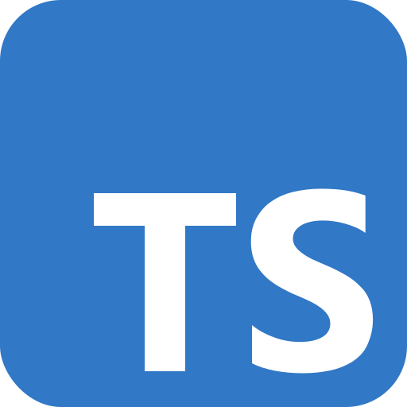

# :informatico_uomo: Full Stack Web Developer
## :buca_lettere: Contact
| Mail | LinkedIn |
|:----:|:--------:|
| <a href="mailto:dinomussuto89@gmail.com"> dinomussuto89@gmail.com</a> | <a href="www.linkedin.com/in/gerardo-michele-mussuto" target="_blank"> LinkedIn – Gerardo Michele Mussuto</a> |
## :ingranaggio: Tech Stack
### :arte: Layout Design
| HTML5 | CSS3 | SASS | Tailwind | Bootstrap | Figma |
|:-----:|:----:|:----:|:--------:|:---------:|:-----:|
|  |  |  |  |  |  |
### :simbolo_atomo: Frontend Development
| JavaScript | TypeScript | React | Git | Redux |
|:----------:|:----------:|:-----:|:---:|:-----:|
|  |  |  |  |  |
### :martello_e_chiave_inglese: Backend Development
| MongoDB | Node | Express | RestAPI |
|:-------:|:----:|:-------:|:-------:|
|  |  |  |  |
